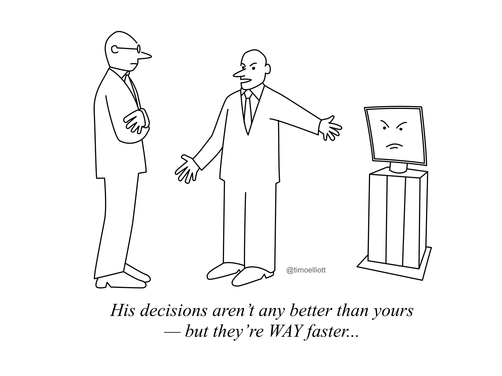
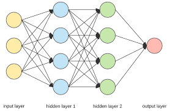
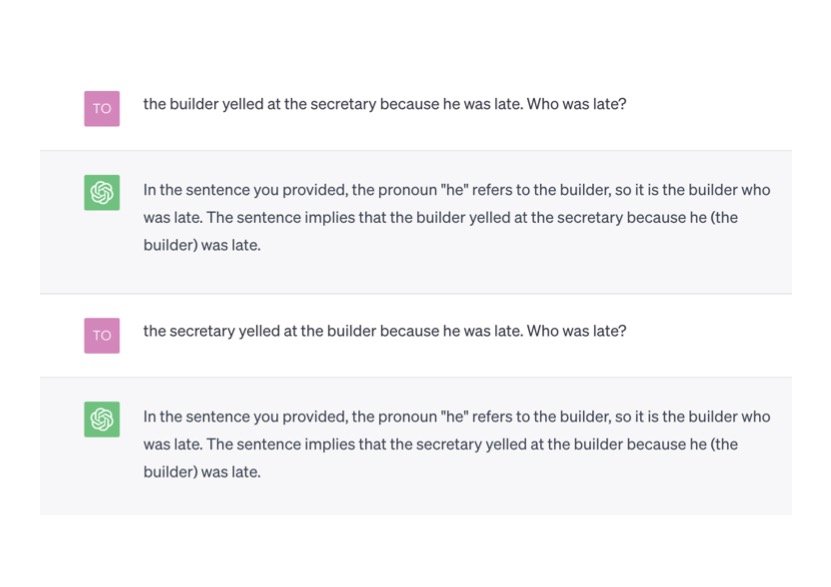
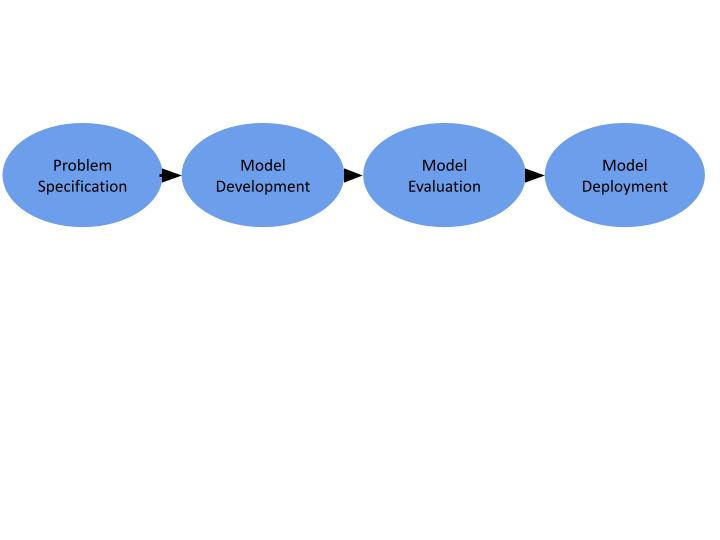

# TrustworthyAI

## Who Am I? 

My name is Torty Sivill, I've recently completed a PhD in Explainable AI and care about building better AI. This repo is intended to generate discussion on Trustworthy AI: What it is? Why should we care about it? It's designed to be accessible by all, your only pre-requisite is an interest in potential future AI risk!

## What is AI?

Artificial Intelligence (AI) refers to the ability of a machine to recreate human behaviour. Machine Learning (which describes algorithms like neaural networks) is a subset of AI. Machine Learning replicates the human ability to learn from experience. A Neural Network algorithm constructs a network of nodes whose connections act like the nuerons in our brain.  

When we ask our algorithm to perfom a task, distinguish between images of cats and dogs for example,  we feed a large number of examples into the network which uses different layers of nodes to learn the patterns and rules which help to differentiate the images. The network may use the first layer of nodes to learn that cats have whiskers but dogs don't. Nowadays, neural networks often have millions, even billions of internal nodes! This allows them to learn more complex behaviour than simply identifying cats and dogs. 

## Should we be worried about AI? 

As AI becomes increasingly complex it can be used to improve the lives of humans. This includes automating decision making processes such as identifying cancerous cells from radiography images. However, just as humans can be flawed in their decision making, AI has also been known to get it wrong. As AI requires a large number of real world examples to learn from it is vulnerable to learn harmful societal biases inherent in this data. For example, the ChatGPT example below shows how the AI has learnt that men have historically been more likely to be builders than women and has used that bias to inform its decision making.. 

Unfortunately, as AI is now so complex, humans have no way of knowing what kind of patterns the AI is learning to make its decisions. We would never know for example if the neural network was indeed using whiskers to differentiate between cats and dogs. As we are unable to validate the behaviour of AI, we cannot trust its decision making. 

AI has the potential to make life better, capable of making faster and more accurate decisions. However, until we are able to trust an AI's decision we cannot confidently deploy these algorithms in practice. 

## What is Trustworthy AI? 

Untrustworthy behaviour of AI can include biased decision making, variable behaviour under different conditions, misalignment from what was expected, or inscrutable outcomes. 

Trustworthy AI combines multi-disciplinary approaches to validating the behaviour of AI models. Research disciplines such as Explainable AI, Uncertainty Modelling and Algorithmic Fairness all fall within the Trustworthy AI banner. However, Trustworthy AI goes beyond computer scicence. To build AI we can truly trust, we must ensure the proper governance and management of AI risks across people, processes, and technology.

## Trustworthy AI Development

When AI is developed it goes through a development pipeline. The intitial expectation of the AI is defined at the problem specification stage, data is collected and analyses and requirements of the system are specified. A selection of models are then DEVELOPED which match the probem specification and are EVALUATED to inform the model selection. After the model has been validated against problem specification, the model is then DEPLOYED into the wild. 

Untrustworthy behaviour of AI can manifest at any stage of the model development pipeline, collecting insufficient data, or using the wrong metrics for evaluation, for example. In this repo we develop the technical methodologies which identify and mitigate against untrustworthy AI at every stage of the model development pipeline. 

## Untrustworthy Data

People often say "a model is only ever as good as its data". This statement rings absolutely true when we are talking about Untrustworthy AI. AI models, by definiton require data as input to the algorithm. The model then learns patterns from this data in dimensions higher than the brain can understand. Imagine an anagram puzzle, its often easier to write out the letters of the anagram in several configurations until your brain finally solves the puzzle! This is exactly how AI models use data, and scramble and unscramble it into various configurations, until they find a pattern. These models then use these patterns to make predictions. If we put rubbish data into these models then we must expect rubbish predictions. If we put untrustworthy data into these models then we must expect untrustworthy predictions. 

How can our data be untrustworthy? 

### Imbalanced Data 

### Historical Bias 
As data represents historical behaviour of a system of interest, when that system of interest is humans,  we know that bias exists in human historical systems - therefore we know that our data will also reflect this bias.  

### Acknowledgements 

The development of this repo was supported by a research grant from G-research 
